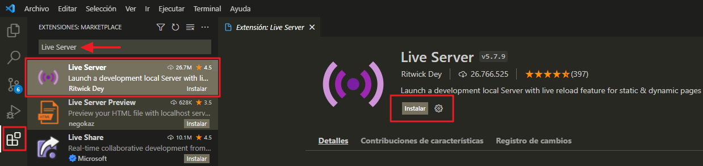
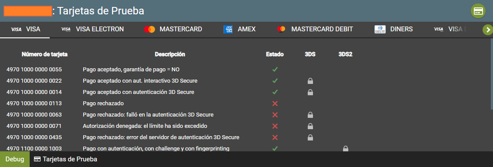

# PopIn-PaymentFormT1-JavaScript

Ejemplo de un formulario incrustado en JavaScript, para poder ejecutar el siguiente ejemplo seguir los pasos del presente manual.

<p align="center">
  
</p>    

<a name="Requisitos_Previos"></a>

## Requisitos Previos

* Extraer credenciales del Back Office Vendedor. [Guía Aquí](https://github.com/izipay-pe/obtener-credenciales-de-conexion)
* Servidor web o servidor local.

## 1.- Crear el proyecto

* Descargar el proyecto .zip haciendo click [Aquí](https://github.com/izipay-pe/PopIn-PaymentFormT1-JavaScript/archive/refs/heads/main.zip) o clonarlo desde Git.  
	```sh
	git clone https://github.com/izipay-pe/PopIn-PaymentFormT1-JavaScript.git
	``` 

* Para ejecutar este proyecto de manera local utilizaremos una extensión de Visual Studio Cod que simulara un servidor web, para instalar esta extensión abrimos Visual Studio Cod y en la parte izquierda nos dirigimos a `Extensiones` y digitamos en el buscador `Live Server` he instalamos la extensión.  

    

* Descomprimimos el archivo descargado `PopIn-PaymentFormT1-JavaScript-main.zip`, se extraerá la carpeta PopIn-PaymentFormT1-JavaScript-main seleccionamos esta carpeta y la abrimos con Visual Studio Cod.

* Ingresamos a la siguiente ruta `scr/index.hmtl` y le damos click derecho dentro del código HTML, buscamos `open with Live Server` para ejecutar, se abrirá en nuestro navegador el proyecto con el siguiente dominio y podrá ver el resultado en: 

  - "http://127.0.0.1:5500/src/index.html"


## 2.- Configurar datos de conexión

**Nota**: Reemplace **[CHANGE_ME]** con sus credenciales de `API REST` extraídas desde el Back Office Vendedor, ver [Requisitos Previos](#Requisitos_Previos).

* Editar en src/index.html en la sección HEAD:

```html
<script 
    type="text/javascript"
    src="https://api.micuentaweb.pe/static/js/krypton-client/V4.0/stable/kr-payment-form.min.js" 
    kr-public-key="~~CHANGE_ME_PUBLIC_KEY~~"
    kr-get-url-success="~~CHANGE_ME_PAGE_REDIRECTION~~"       
    kr-language="es-ES"
>
</script>
``` 

* Editar el endpoint el cual retornara el formtoken en src/app.js:

```javascript 
	request.open('POST', 'YOUR_SERVER/payment/init', true);
	request.setRequestHeader('Content-Type', 'application/json');
```

## 3.- Transacción de prueba

El formulario de pago está listo, puede intentar realizar una transacción utilizando una tarjeta de prueba con la barra de herramientas de depuración (en la parte inferior de la página).

  

Para obtener más información, eche un vistazo a:

- [Formulario popin: prueba rápida](https://secure.micuentaweb.pe/doc/es-PE/rest/V4.0/javascript/quick_start_popin.html).
- [Primeros pasos: pago simple](https://secure.micuentaweb.pe/doc/es-PE/rest/V4.0/javascript/guide/start.html).
- [Servicios web - referencia de la API REST](https://secure.micuentaweb.pe/doc/es-PE/rest/V4.0/api/reference.html).
 
## 4.- Implementar IPN

* Ver manual de implementacion de la IPN [Aquí](https://secure.micuentaweb.pe/doc/es-PE/rest/V4.0/kb/payment_done.html).

* Ver el ejemplo de la respuesta IPN con PHP [Aquí](https://github.com/izipay-pe/Redirect-PaymentForm-IpnT1-PHP).

* Ver el ejemplo de la respuesta IPN con NODE.JS [Aquí](https://github.com/izipay-pe/Response-PaymentFormT1-Ipn).
